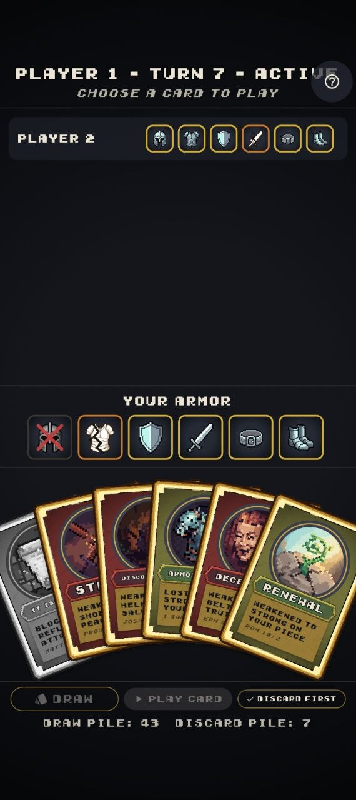
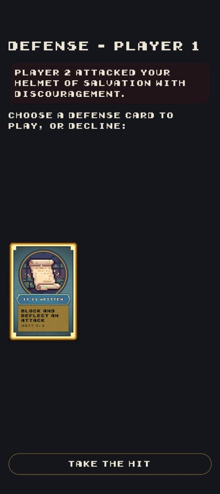
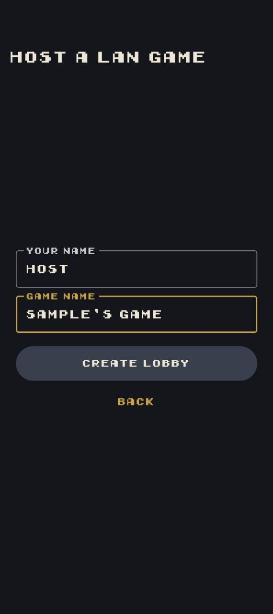

# Armor Up!

A Flutter card game that teaches the Armor of God (Ephesians 6) through
take-that gameplay — 2-6 players, hotseat pass-and-play or LAN
multiplayer.

## Why this exists

Built for Sunday school and youth group settings, where a lesson on
spiritual armor benefits from something more memorable than a worksheet.
Each player defends six armor pieces against attacks from the rest of the
table; a hit degrades a piece from Strong to Weakened to Lost, and it's
only repaired through Renewal, Armor Bearer, or Fasting — so the back
half of every game is a scramble between finishing opponents off and
restoring your own armor before someone else does.

<p align="center">
  
  
  
</p>

## Status

**Engine + hotseat: complete. LAN multiplayer: functional. Defense-response
UX: in active development.**

- Pure Dart rules engine covering every card type (attack, defense,
  restore, event), turn structure, and all three win conditions —
  97 unit tests.
- Hotseat Flutter UI with a full pixel-art card/armor set and a dark
  charcoal theme.
- LAN multiplayer over WebSockets: host/join lobby, reconnect via session
  tokens, player-filtered game state so hands stay hidden from other
  clients — 38 tests in the `net` package, plus dedicated LAN-flow widget
  tests (lobby, disconnect handling, discovery) in the Flutter layer.
- Balance-tested with a deterministic bot simulation harness across
  thousands of simulated games per configuration (player count, defend
  rate, restoration-win toggle) — see [BALANCE_REPORT_4.md](BALANCE_REPORT_4.md)
  for the current baseline (full report history indexed in
  [BALANCE_REPORT.md](BALANCE_REPORT.md)).
- Current focus: polishing the LAN defense-response flow (countdown,
  waiting states, shared resolution beat) and eliminated-player cleanup.
  See [CHANGES.md](CHANGES.md) for the detailed change log.

## Architecture

Three-package structure that keeps rules, networking, and UI strictly
separated:

```
armor_up/
  packages/
    game_engine/        # Pure Dart rules engine — no Flutter, no network deps
      lib/
      test/             # Unit tests for every card and rule interaction
      bin/simulate.dart # Deterministic bot-driven balance simulator
    net/                 # LAN multiplayer transport — no Flutter dep
      lib/src/
        host_server.dart    # WebSocket host
        game_client.dart    # Client connector + reconnect via session token
        filtered_state.dart # Redacts other players' hands before sending
        action_codec.dart / state_codec.dart # JSON wire format
      test/
  lib/                   # Flutter UI
    screens/
    widgets/
    theme/               # ArmorUpColors - single source of truth for the palette
    state/               # Riverpod providers wrapping the engine + net client
  test/                  # Flutter widget tests, including LAN-flow screens
```

`game_engine` has zero knowledge of Flutter or networking, so every rule
interaction is unit-testable in isolation. `net` depends only on
`game_engine` and `dart:io`, turning engine state and actions into a
player-filtered JSON wire format so a client can never see another
player's hand. The Flutter app is a thin layer on top of both, using
Riverpod to bridge engine/net state into widgets.

A particular highlight is `packages/game_engine/bin/simulate.dart`: a
deterministic, seeded simulation harness that plays out full games with
random-legal-move bots and reports game-length distributions, win-type
breakdowns, first-player advantage, and per-card play/winner-correlation
stats. It turns card balance changes — timing tweaks, new win conditions,
defend-rate assumptions — into an evidence-based decision instead of a
guess; every number in [BALANCE_REPORT_4.md](BALANCE_REPORT_4.md) (the
current baseline — see [BALANCE_REPORT.md](BALANCE_REPORT.md) for the
full report history) comes from thousands of reproducible simulated
games.

## Tech stack

- **Flutter** / **Dart** (built against Flutter 3.44 / Dart 3.12)
- **Riverpod** — state management bridging engine and UI
- **dart:io WebSockets** — LAN host/client transport, no external service
- **package:test** — unit and widget tests across all three packages
- Pixel-art card/armor assets and two bundled pixel fonts (see
  [CREDITS.md](CREDITS.md) for third-party art attribution)

## Running it locally

### Prerequisites

- [Flutter SDK](https://docs.flutter.dev/get-started/install). Check your
  setup with `flutter doctor`.
- A web browser (Chrome or Edge) is the easiest way to run the app, no
  extra setup required. Native Windows builds need Visual Studio with the
  "Desktop development with C++" workload installed.

If your terminal reports `flutter` (or `dart`) as not recognized, add the
Flutter SDK's `bin` directory to your `PATH`:

```powershell
# PowerShell, permanent (user-level) — adjust the path to your SDK location
[Environment]::SetEnvironmentVariable("Path", [Environment]::GetEnvironmentVariable("Path", "User") + ";C:\flutter\bin", "User")
```

### Run

From the repository root:

```bash
flutter pub get
flutter run -d chrome   # or: -d edge, -d windows
```

Hotseat mode: pick "Pass and Play" on the mode-select screen, enter 2-6
player names, and pass the device between turns. LAN mode: pick "LAN
Multiplayer" — one device hosts (spins up a local WebSocket server), the
rest join over the same Wi-Fi network; reconnect is automatic via session
token if a client drops mid-game.

<details>
<summary>Running on an Android phone wirelessly</summary>

**One-time setup:**

1. On the phone: enable Developer Options (Settings → About phone → tap
   **Build number** 7 times), then turn on **Wireless debugging** under
   Settings → Developer options.
2. Make sure the phone and your computer are on the same Wi-Fi network.
3. Tap **Wireless debugging** → **Pair device with pairing code**. It
   shows an IP:port and a 6-digit code.
4. On the computer, pair once: `adb pair <ip>:<pairing-port>` and enter
   the 6-digit code when prompted.

**Each time you want to run:**

1. On the phone's Wireless debugging screen, note the IP:port shown next
   to the device name (differs from the pairing port).
2. `adb connect <ip>:<port>` then `flutter devices` — the phone should
   show up in the device list.
3. `flutter run -d <device-id>`.

The connection stays paired, so later sessions can usually skip pairing
and just `adb connect <ip>:<port>` again.

</details>

<details>
<summary>Building a standalone web build</summary>

```bash
flutter build web --release
```

Serve `build/web/` with any static file server (e.g. `npx serve build/web`).

</details>

### Tests

```bash
cd packages/game_engine && dart test   # engine unit tests
cd packages/net && dart test           # LAN transport tests
flutter test                           # Flutter widget tests

flutter analyze                        # static analysis
cd packages/game_engine && dart analyze
```

### Balance simulation

```bash
cd packages/game_engine
dart run bin/simulate.dart --games 1000 --seed 12345 --players cycle
```

Prints game-length distribution, win-type breakdown, seat win rates,
reshuffle counts, and per-card play/winner-correlation stats — fully
reproducible from the printed config. See the header comment in
`simulate.dart` for all flags.

## Game rules summary

- **Setup:** 2-6 players, each dealt a 5-card hand and six Strong armor
  pieces (Helmet, Breastplate, Shield, Sword, Belt, Shoes) from a shared,
  seeded 62-card deck.
- **Turn:** draw, optionally play one card, discard down to 5 if over,
  end turn.
- **Card types:** Attack (Trial) degrades an opponent's armor piece;
  Defense blocks or reflects an incoming attack — Prayer blocks outright,
  It Is Written blocks *and* reflects the attack back at its sender, and
  Fellowship asks the rest of the table for help blocking; Restore
  repairs your own armor (Renewal, Armor Bearer, or Fasting); Event
  affects the whole table at once.
- **Winning:** eliminate every other player (all their armor Lost), fully
  restore all six of your own pieces after having taken damage, or — if
  both draw and discard piles run dry — have the most fully-restored
  armor when the deck is exhausted.

Full card-by-card rules text ships in-app (accessible from the in-game
menu) rather than duplicated here.

## License

Code is licensed under the MIT License — see [LICENSE](LICENSE).

### Content License

The game design, rules text, and card content (excluding third-party
assets credited in [CREDITS.md](CREDITS.md)) are licensed under
[CC BY 4.0](https://creativecommons.org/licenses/by/4.0/). You are free
to share and adapt this material for any purpose, including commercially,
as long as you give appropriate credit to Joanderson Quindoza
(quindoza.dev).
